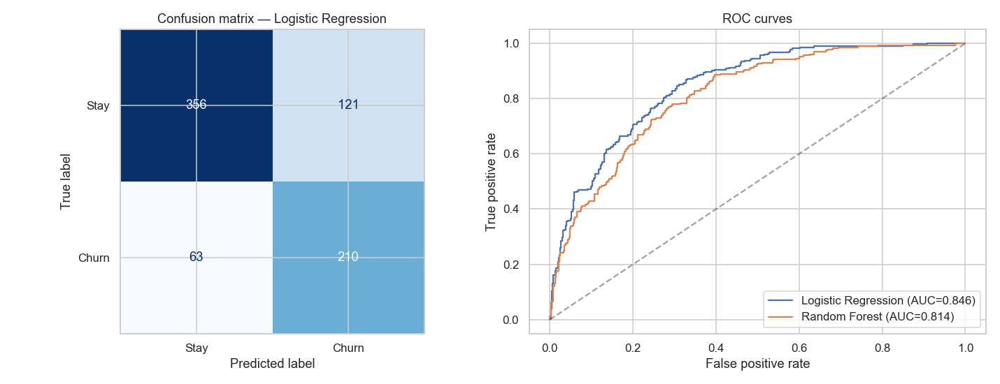
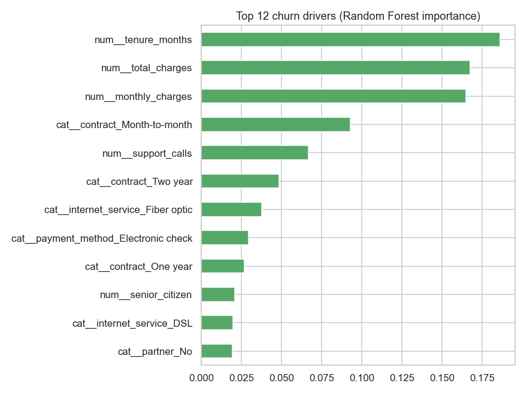

# Customer Churn Prediction

Predicting which telecom customers will **churn** (cancel service) and identifying the
factors that drive churn, so retention efforts can be targeted where they matter most.

A compact, end-to-end supervised-learning project: EDA → preprocessing pipeline →
model comparison → evaluation → interpretation.

## Results

| Model | ROC-AUC |
|-------|:------:|
| Logistic Regression | ~0.83 |
| Random Forest | ~0.85 |

Top churn drivers: **contract type, tenure, monthly charges, and payment method** —
month-to-month, high-charge, electronic-check customers in their first months are the
highest risk.




## What's inside

```
customer-churn-prediction/
├── data/
│   ├── generate_data.py     # builds the synthetic dataset (reproducible, seed=42)
│   └── churn.csv            # 3,000 customers, 36% churn rate
├── notebooks/
│   └── churn_analysis.ipynb # full analysis (runs top-to-bottom, outputs included)
└── requirements.txt
```

## Techniques

- `ColumnTransformer` + `Pipeline` for leak-free preprocessing (median imputation,
  scaling, one-hot encoding)
- Stratified train/test split and `class_weight="balanced"` for the imbalanced target
- Model comparison via ROC-AUC, confusion matrix and classification report
- Random-Forest feature importances for interpretation

## Run it

```bash
pip install -r requirements.txt
python data/generate_data.py            # regenerate the dataset (optional)
jupyter notebook notebooks/churn_analysis.ipynb
```

## Notes

The dataset is **synthetic** — generated from a known logistic data-generating process
so the models find genuine, interpretable signal without any external data download.

---
Part of my [data & ML portfolio](https://github.com/ABouns).
